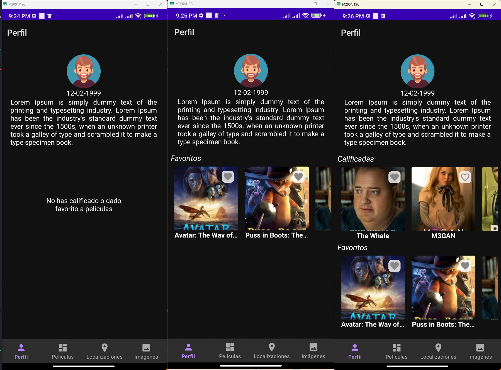
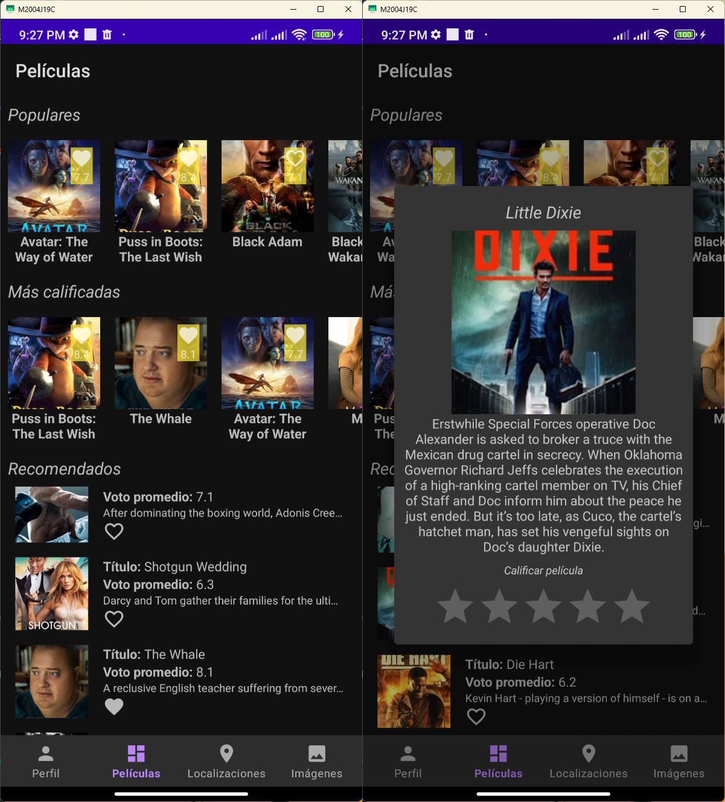
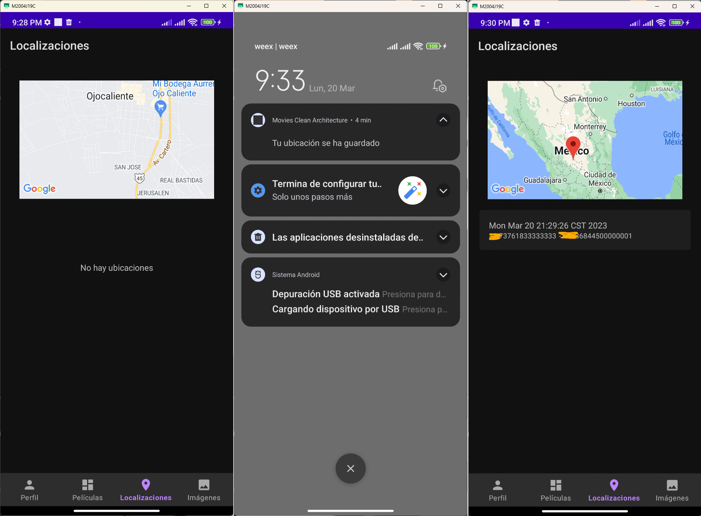
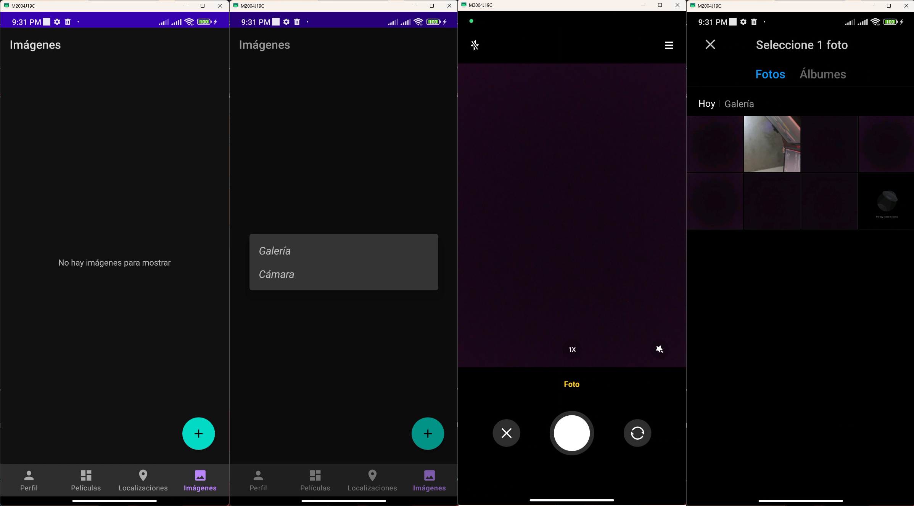
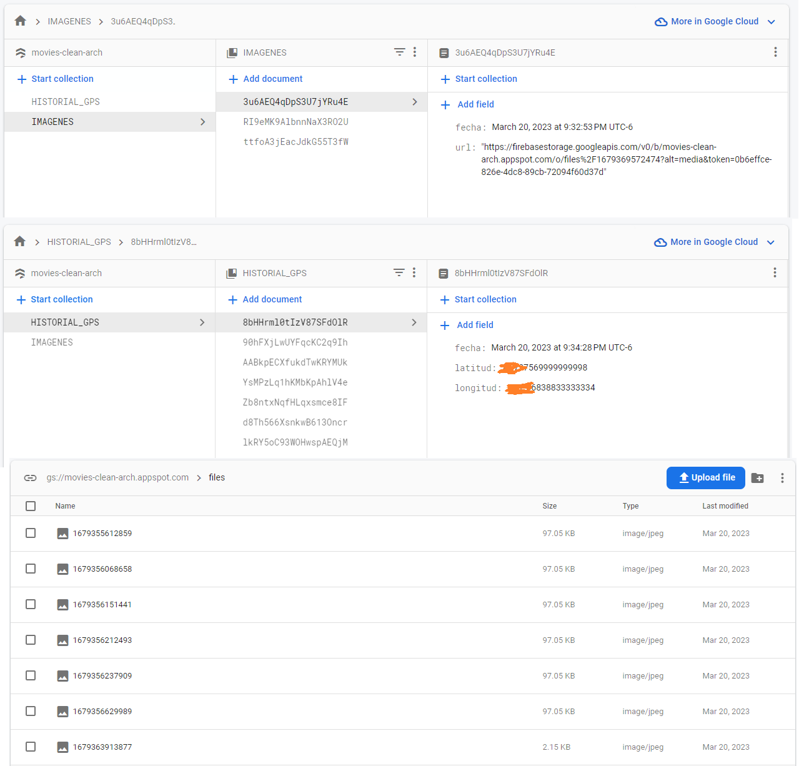
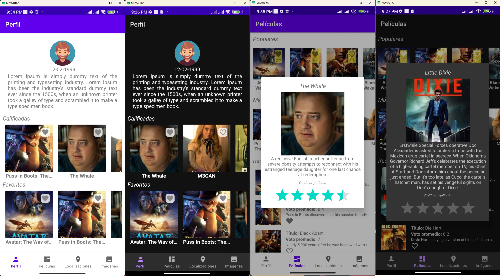
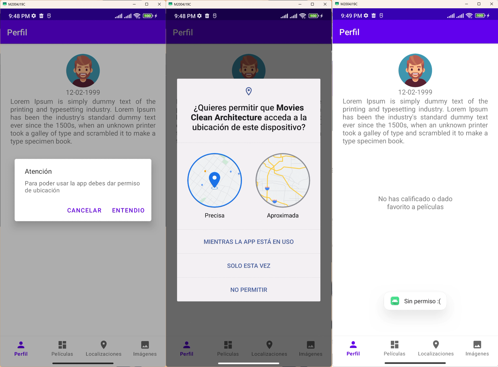

# Pantallas

## Resumen
Principales caracteristiscas
- MVVM
- Hibrido entre compose y xml
- Entorno reactivo
- Manejo de validaciones para datos vacios
- Manejo de permisos
- Inyeccion de dependencias
- TDD
- Persistencia de datos
- Uso de camara nativa

## Perfil (Compose) 


## Peliculas


## Ubicaciones


## Imagenes


## Firebase


## Informacion
### Librerias y versiones
```sh
    //Hilt
    implementation 'com.google.dagger:hilt-android:2.44'
    kapt 'com.google.dagger:hilt-android-compiler:2.44'

    //Room
    implementation "androidx.room:room-runtime:2.5.0"
    implementation "androidx.room:room-ktx:2.5.0"
    kapt "androidx.room:room-compiler:2.5.0"

    // Network
    implementation "com.squareup.okhttp3:okhttp:4.9.0"
    implementation "com.squareup.retrofit2:retrofit:2.9.0"
    implementation "com.squareup.retrofit2:converter-gson:2.9.0"
    implementation "com.google.code.gson:gson:2.9.0"

    //Glide
    implementation "com.github.bumptech.glide:glide:4.12.0"
    implementation "com.github.bumptech.glide:okhttp3-integration:4.11.0"
    kapt "com.github.bumptech.glide:compiler:4.12.0"

    //Compose
    implementation "androidx.activity:activity-compose:1.6.1"
    implementation "androidx.compose.ui:ui:1.4.0-rc01"
    implementation "androidx.compose.material:material:1.4.0-rc01"
    implementation "androidx.compose.ui:ui-tooling:1.4.0-rc01"
    implementation "androidx.compose.ui:ui-tooling-preview:1.4.0-rc01"
    implementation "androidx.compose.animation:animation:1.4.0-rc01"
    implementation "androidx.lifecycle:lifecycle-viewmodel-compose:2.6.0"
    implementation "io.coil-kt:coil-compose:1.4.0"

    //Firebase
    implementation 'com.google.firebase:firebase-firestore:24.4.4'
    implementation 'com.google.firebase:firebase-storage-ktx:20.1.0'

    implementation 'com.google.android.gms:play-services-maps:18.1.0'
```

### Vistas y tema
La vista de perfil esta hecha en Compose, las demas estan en xml, todas las pantallas y dialogos soportan tema oscuro y claro



### Manejo de permisos
El manejo de permisos se hace a traves de dialogos amigables, y se valida los rechazos mostrando toast



### Que mejoraria
Para el tema de mostrar mensajes, me gustaria cambiar los toast por algunas alertas mas amigables y mas controlables.
Actualmente, las calificaciones y usuario se manejan de manera local con info de prueba. Me hubiera gustado usar el endpoint del api para obtener un session id de invitado para hacerlo mas completo todo el flujo.
Tambien, agregaria una capa mas a los repositorios, para asi inyectar solamente casos de uso a los viewmodels.
Por ultimo, si la ubicacion fuese de minimo 15min, me gustaria mejor haber usado un worker para manejar el tema de la periodicidad.
